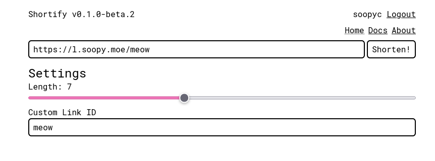

# Shortify

Sleek self-hostable link shortening service. No analytics included!

## Deployment

> [!NOTE]
>
> We only support PostgreSQL databases.

### Setup

To generate required keys, you might want to use the provided utility available at `utils/jwt_generate.ts`. This tool requires Deno to run.

As the project uses the standardized JSON Web Key format, it is possible to generate keys usable in this project without having to use the tool.
